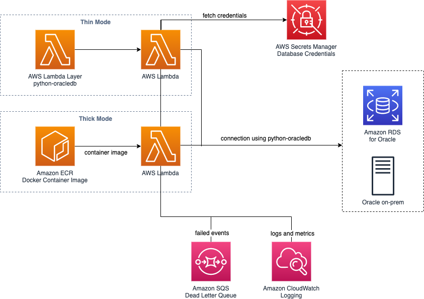

# Oracle Database Connection in AWS Lambda using Python

This example shows how to connect to an Oracle database (RDS or on-prem) from AWS Lambda using python.
The official Oracle driver (python-oracledb) comes with two different modes: (1) a *thin* mode that does not
require any additional system libraries, but comes with a few limitations and a *thick* mode, which requires the Oracle Instant Client with system dependencies
to connect to an Oracle database. The example here deploys both versions of the driver. However, the thick mode does not fit well into a lambda package or layer. Therefore
this example shows how to use Lambda container images to properly install the Oracle dependencies. The thin mode can be deployed using a simple lambda layer and is the leaner version.

This example will deploy both, the thin and the tick mode for reference. For application usage, we recommend to pick the option that is suitable for the application. See the following reference for
a description of these options: https://python-oracledb.readthedocs.io/en/latest/user_guide/appendix_a.html#featuresummary




## Requirements

The following software is necessary on the client in order to build and deploy this example.

- Python 3.9.x (preferably with a dedicated virtualenv)
- Docker 19.x or above
- CDK version 2.3.0

In addition, this setup does not include an Oracle database, but assumes that one already exists.
The deployment procedure outlined below will download and install the [python-oracledb driver](https://oracle.github.io/python-oracledb/index.html) and [Oracle Instant Client](http://www.oracle.com/technetwork/database/database-technologies/instant-client/overview/index.html), both are subject to separate licensing terms.


## AWS Services

The following AWS services are used to run this example.

- **AWS Lambda** establish connection and run queries against Oracle database
- **Elastic Container Registry (Amazon ECR)** storage for lambda container image versions
- **AWS Secrets Manager** store credentials to connect to Oracle database
- **AWS X-Ray** providing tracing information for lambda
- **AWS SQS** dead letter queue for lambda failed lambda events


## Deployment Instructions

1. Install build and deployment dependencies:

    ```
    python -m pip install -r requirements-dev.txt
    ```

2. Setup AWS profile to point to the account to deploy, either using AWS_PROFILE or through setting AWS_ACCESS_KEY_ID and AWS_SECRET_ACCESS_KEY.

3. Deploy stack using CDK

    ```
    cd cdk
    cdk bootstrap
    cdk deploy
    ```

4. Open SecretsManager in the AWS Console and adapt the connection settings in the secret `py-oracle-connection-credentials`

    

5. Open the Lambda function `py-oracle-connection-example-thin` or `py-oracle-connection-example-thick` in the AWS Console and specify the correct VPC settings in order to connect to the Oracle database.

    

6. Execute the lambda function with an empty example payload (e.g. `{}`)

    

7. Adapt the lambda handler as necessary to execute queries against Oracle database, see [lambda_handler.py](functions/thin/lambda_handler.py)

8. Destroy all resources when tests are done

    ```
    cd cdk
    cdk destroy
    ```

## Limitations

The example presented here opens an Oracle database connection per execution. This is not suitable for high-throughput scenarios. Therefore it is adviced
to configure the reserved concurrency for the lambda according to the maximum open connections in parallel that the database allows for.

## Reference

 - [Lambda Container Images](https://docs.aws.amazon.com/lambda/latest/dg/images-create.html)
 - [Lambda Secrets Management](https://aws.amazon.com/blogs/security/how-to-securely-provide-database-credentials-to-lambda-functions-by-using-aws-secrets-manager/)
 - [Oracle Driver Documentation](https://cx-oracle.readthedocs.io/en/latest/)


## Contributions

See CONTRIBUTING for more information.


## License

This library is licensed under the MIT-0 License. See the LICENSE file.
